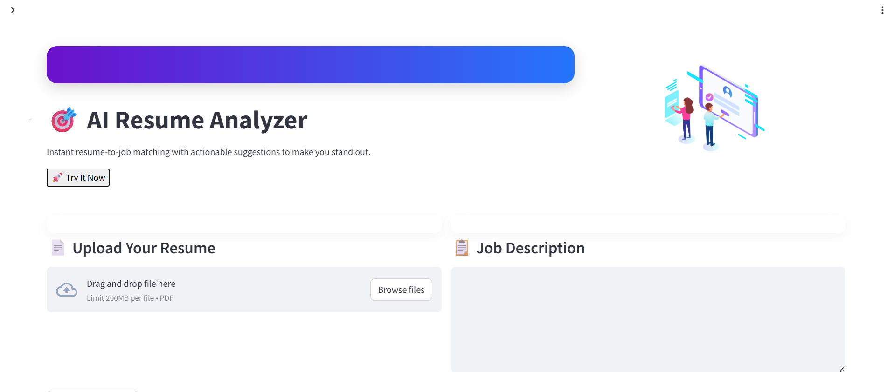

# 🎯 AI Resume Analyzer

An AI-powered web app that compares a resume against a job description, calculates a **match percentage**, identifies **missing skills**, and suggests **projects** to improve your profile.

Built with:
- **FastAPI** backend (Ollama + Mistral for LLM-based analysis)
- **Streamlit** frontend (custom styled with animations, gauges, and responsive design)
- **PyPDF2** for PDF text extraction

---

## 🚀 Features
- 📄 **PDF Resume Upload** — Extracts text from uploaded resumes
- 📋 **Job Description Input** — Paste or type job requirements
- 📊 **Match Score Gauge** — Animated visual representation of fit percentage
- ❌ **Missing Skills Detection** — Highlights skills not found in the resume
- 💡 **Project Suggestions** — Recommends hands-on projects to improve match
- 📱 **Responsive UI** — Works seamlessly on desktop and mobile
- 🎨 **Custom UI/UX** — Gradient headers, animations, and modern card design

---

## 🖼 Screenshots

### Main Dashboard

---

## 🛠 Tech Stack
**Backend**
- FastAPI
- Ollama + Mistral
- PyPDF2

**Frontend**
- Streamlit
- Lottie Animations
- Custom CSS

---

## 📂 Project Structure
#resume-analyzer/
#├── backend/
#│ ├── analyze.py # LLM analysis logic
#│ ├── main.py # FastAPI server
#├── frontend/
#│ ├── streamlit.py # Streamlit UI
#├── assets/ # Screenshots, icons, etc.
#├── requirements.txt
#└── README.md
